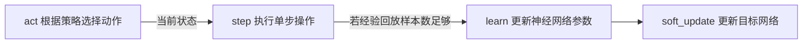

> 自2021年以来，强化学习已经有了长足的发展， 这个系列主要回顾强化学习和对一些强化学习的拓展算法进行复现和整理。

## 1. 深度Q学习
深度Q学习将深度学习和强化学习相结合，是第一个深度强化学习算法。深度Q学习的核心就是用一个人工神经网络$q(s,a;\theta),s∈\mathcal{S},a∈\mathcal{A}$来代替动作价值函数。其中$\theta$为神经网络权重。由于神经网络具有强大的表达能力，能够自动寻找特征，所以采用神经网络有潜力比传统人工特征强大得多。当同时出现异策、自举和函数近似时，无法保证收敛性，会出现训练不稳定或训练困难等问题。针对出现的各种问题，研究人员主要从以下两方面进行了改进。
- **经验回放（experience replay）**：将经验（即历史的状态、动作、奖励等）存储起来，再在存储的经验中按一定的规则采样。
- **目标网络（target network）**：修改网络的更新方式，例如不把刚学习到的网络权重马上用于后续的自举过程。本节后续内容将从这两条主线出发，介绍基于深度Q网络的强化学习算法。

### 0. 异策、自举和函数近似
在深度Q学习（DQN）中，异策（off-policy）、自举（bootstrapping）和函数近似（function approximation）是强化学习中的三个关键概念。这些概念在强化学习中起着重要作用，但当它们结合在一起使用时，会引起训练不稳定或训练困难等问题。以下是对这些概念的详细解释：

#### 异策（Off-Policy）

异策强化学习算法是在执行策略和学习策略不同时使用的算法。具体来说：

- **执行策略（Behavior Policy）**：智能体在与环境交互时实际使用的策略，通常包含探索（如epsilon-greedy策略）。
- **目标策略（Target Policy）**：智能体在更新Q值或策略时所依据的策略，通常是较为贪心的策略。

DQN是一种异策方法，因为它使用epsilon-greedy策略来选择动作（执行策略），但更新Q值时使用的是目标策略（通过最大化目标Q值来更新）。

#### 自举（Bootstrapping）

自举是指在更新当前状态的价值估计时，使用未来状态的价值估计。这意味着当前的价值估计依赖于其他状态的价值估计，这种方法可以加速学习过程，但也可能导致不稳定性。

在Q学习和深度Q学习中，使用的是自举更新方法。更新公式为：
$$ Q(s, a) \leftarrow Q(s, a) + \alpha \left( r + \gamma \max_{a'} Q(s', a') - Q(s, a) \right) $$
其中，下一状态的价值估计 $\max_{a'} Q(s', a')$ 用于当前状态的更新。

#### 函数近似（Function Approximation）

函数近似是指使用一个函数（如神经网络）来近似Q值函数或策略。传统的强化学习方法（如表格方法）只能处理有限状态和动作空间，对于连续或高维状态空间，这些方法无法有效处理。通过函数近似，可以扩展到处理更复杂的任务。

在DQN中，使用神经网络作为函数近似器来表示Q值函数 $Q(s, a; \theta)$，其中 $\theta$ 为神经网络的权重。

#### 结合使用的问题

当异策、自举和函数近似结合使用时，会带来以下问题：

1. **估计误差的积累和放大**：
   - 由于自举方法依赖于其他状态的估计值，任何估计误差都会被传播和放大，尤其是在使用函数近似时，误差会在神经网络的多层传播中积累。

2. **训练不稳定性**：
   - 函数近似的高表达能力可能导致过拟合，加上异策学习和自举更新的特点，会导致训练过程中的高方差和不稳定性。

3. **非平稳目标**：
   - 在Q学习中，目标Q值会不断变化，因为每次更新都依赖于最新的Q网络参数。这种非平稳性使得训练变得更加困难。

#### 解决方案

为了应对这些问题，研究人员提出了以下两种主要改进方法：

1. **经验回放（Experience Replay）**：
   - 将智能体的经验存储在一个回放缓冲区中，并在训练时从缓冲区中随机抽取小批量样本进行更新。这种方法打破了经验的时间相关性，提高了样本的利用效率，并减少了方差。

2. **目标网络（Target Network）**：
   - 在每次更新Q值时，使用一个固定的目标网络来计算目标Q值，而不是直接使用当前网络的参数。目标网络的参数只在一定间隔或通过软更新方式更新，这样可以减少非平稳目标带来的问题，提高训练的稳定性。

通过这些改进，DQN能够在复杂的任务中更稳定和高效地学习和训练。


### 1.1 经验回放
V. Mnih 等在 2013 年 发 表 文 章 《Playing Atari with deep reinforcement leaming》，提出了基于经验回放的深度Q网络，标志着深度Q网络的诞生，也标志着深度强化学习的诞生^[来自于《强化学习：原理与python实现》]。

采用批处理的模式能够提供稳定性。经验回放就是一种让经验的概率分布变得稳定的技术，它能提高训练的稳定性。
经验回放主要有“存储”和 “采样回放”两大关键步骤。其相关算法在之后会介绍, 现在主要来看其特征。
- 存储：将轨迹以$(S_t,A_t, R_{t+1}, S_{t+1})$ 等形式存储起来； 
- 采样回放：使用某种规则从存储的$(S_t,A_t, R_{t+1}, S_{t+1})$ 中随机取出一条或多条经验。 

经验回放有以下好处。
- 在训练Q网络时，可以消除数据的关联，使得数据更像是独立同分布的（独立同分布是很多有监督学习的证明条件）。这样可以减小参数更新的方差，加快收敛。
- 能够重复使用经验，对于数据获取困难的情况尤其有用。从存储的角度，经验回放可以分为集中式回放和分布式回放。

回放可以分为以下几种,
- **集中式回放**：智能体在一个环境中运行，把经验统一存储在经验池中。
- **分布式回放**：智能体的多份拷贝(worker)同时在多个环境中运行，并将经验统一存 储于经验池中。由于多个智能体拷贝同时生成经验，所以能够在使用更多资源的同
时更快地收集经验。从采样的角度，经验回放可以分为均匀回放和优先回放。
- **均匀回放**：等概率从经验集中取经验，并且用取得的经验来更新最优价值函数。
- **优先回放**(PrioritizedExperienceReplay, PER): 为经验池里的每个经验指定一个优
先级，在选取经验时更倾向于选择优先级高的经验。

T. Schaul等 于 2016年发表文章《Prioritized experience replay》，提出了优先回放。优先回放的基本思想是为经验池里的经验指定一个优先级，在选取经验时更倾向于选择优先级高的经验。一般的做法是，如果某个经验(例如经验$i$)的优先级为$p_i$，那么选取该经验的概率为
$$p_i = \frac{p_i}{\sum_{k} p_k}$$


经验值有许多不同的选取方法，最常见的选取方法有**成比例优先**和**基于排序优先**。
- **成比例优先**(proportional priority):第$i$个经验的优先级为
$$p_i = {(\delta_i + \varepsilon)^{\alpha}}$$
其中$\delta_i$是时序差分误差，$\varepsilon$是预先选择的一个小正数，$\alpha$是正参数。
- **基于排序优先(rank-basedpriority)**:第$i$个经验的优先级为
$$ p_i = (\frac{1}{\text{rank}_{i}})^{\alpha}$$
其中$\text{rank}_{i}$是第$i$个经验从大到小排序的排名, 排名从1开始。

经验回放也不是完全没有缺点。例如，它也会导致回合更新和多步学习算法无法使用。一般情况下，如果我们将经验回放用于Q学习，就规避了这个缺点。


### 1.2 目标网络
对于基于自举的Q学习，其回报的估计和动作价值的估计都和权重$\theta$有关。当权重值变化时，回报的估计和动作价值的估计都会变化。在学习的过程中，动作价值试图追逐一个变化的回报，也容易出现不稳定的情况。可以使用之前介绍的半梯度下降的算法来解决这个问题。在半梯度下降中，在更新价值参数$\theta$时，不对基于自举得到的回报估计$U_{t}$求梯度。其中一种阻止对$U_t$求梯度的方法就是将价值参数复制一份得到$\theta_{\text{target}}$， 在计算$U_t$时用$\theta_{\text{target}}$目标计算。

基于这一方法，V. Mnih等 在 2015年发表了论文《Human-level control through deep reinforcement learning》提出了**目标网络（target network）** 这一概念。 目标网络是在原有的神经网络之外再搭建一份结构完全相同的网络。原先就有的神经网络称为**评估网络（ evaluation network）**。在学习的过程中，使用目标网络来进行自举得到回报的评估值，作 为学习的目标。在权重更新的过程中，只更新评估网络的权重，而不更新目标网络的权重。这样，更新权重时针对的目标不会在每次迭代都变化，是一个固定的目标。在完成一定次数的更新后，再将评估网络的权重值赋给目标网络，进而进行下一批更新。这样，目标网络也能得到更新。由于在目标网络没有变化的一段时间内回报的估计是相对固定的，**目标网络的引入增加了学习的稳定性**。所以，目标网络目前已经成为深度Q学习的主流做法。

### 1.3 相关算法
现在我们考虑使用深度Q学习算法来训练智能体玩游戏^[参考于《Human-level control through deep reinforcement learning》Volodymyr Mnih等 ]。

在每一个时间步骤中，智能体从游戏动作集$\mathcal{A} = {1, ... K}$中选择一个动作。该动作被传递给模拟器并修改其内部状态和游戏分数。在一般情况下，环境可能是随机的。仿真器的内部状态不被智能体观察到，相反，智能体观察到一个来自仿真器的图像$x_t\in \mathbb{R}^d$，这是一个代表当前屏幕的像素值的向量。此外，它还会收到代表游戏分数变化的奖励 $r_t$。需要注意的是，一般情况下，游戏得分可能取决于之前的整个动作和观察序列；关于一个动作的反馈可能只有在经过数千次的时间步长之后才会收到。


由于智能体只能观察当前屏幕，任务是部分观察，许多模拟器状态在感知上是异构的（即不可能只从当前屏幕$x_t$中完全了解当前情况）。因此，动作和观察的序列$s_t = x_1,a_1,x_2,...,a_{t-1},x_t$ 被输入到算法中，然后算法根据这些序列学习游戏策略。仿真器中的所有序列都被假定为在有限的时间步长内终止。这个形式化的过程产生了一个大而有限的马尔科夫决策过程(MDP)，在这个过程中，每个序列都是一个独立的状态。因此，我们可以将标准的强化学习方法应用于MDP，只需将完整序列$s_t$作为时间$t$的状态表示即可。  


智能体的任务是在模拟器中选择最佳的动作最大化未来的损失.我们做一个标准的假设,对未来的每一步回报采用一个折扣因子$\gamma$($\gamma$从始至终设置为0.99),然后定义了在时间$t$上经过折扣后的回报$R_t = \sum_{t'=t}^{T}\gamma^{t'-t}r_{t'}$,其中$T$为最终停止的时间步。我们定义最佳动作价值函数$Q^*(s, a)$作为遵循任何策略所能获得的最大预期收益。在经过一些状态$s$和采取一些动作$a$后,$Q^*(s, a) = \max_{\pi}\mathbb{E}[R_t|s_t = s, a_t =a, \pi]$,其中$\pi$作为在状态$s$采取的动作$a$的映射,即策略。

最优行为价值函数遵循一个重要的恒等式，这个恒等式被称为贝尔曼方程(Bellman equation)。这基于以下直觉:如果状态$s'$在下一个时间步的最优值$Q^*(s', a')$对于所有可能的行动$a'$都已知，那么最优策略就是选择使期望值$r + \gamma Q^*(s', a')$最大化的行动$a'$:
$$Q^*(s, a) = \mathbb{E}_{s'}[r + \gamma \max_{a'}Q^*(s', a')|s, a]$$

许多强化学习算法背后的基本思想是通过使用贝尔曼方程作为迭代更新来估计动作价值函数，$Q_{i+1}(s, a) = \mathbb{E}_{s'}[r + \gamma \max_{a'}Q_{i}(s', a')|s, a]$。这些价值迭代算法都收敛于最优动作价值函数,当$i\to \infin$时$Q_i \to Q^*$。**在实践中，这种基本的方法是不切实际的，因为动作-价值函数是对每个状态分别估计的，没有任何泛化。** 相反，通常使用函数逼近器来估计动作价值函数$Q(s, a;\theta) \approx Q^*(s, a)$。在强化学习中这是典型的线性函数逼近器，但是有时用非线性函数逼近器代替，如神经网络。我们把带有权值$\theta$的神经网络函数逼近器称为$Q$网络。$Q$网络可以通过在迭代$i$中调整参数$\theta_i$来训练减少贝尔曼方程中的均方误差, 其中最佳目标值$r+\gamma \max_{a'}Q^*(s', a')$被替代为近似目标值$y =r+\gamma \max_{a'}Q(s', a';\theta_i^{-})$,其使用先前的一些迭代中的参数$\theta_{i}^{-}$。这就产生了一个损失函数$L_i(\theta_i)$的序列，它在每次迭代$i$时发生变化，

$$\begin{aligned}L_i(\theta_i) & = \mathbb{E}_{s, a,r} [(\mathrm{E}_{s'}[y|s,a] - Q(s,a;\theta_i))^2] \\ &= \mathbb{E}_{s, a,r, s'}[(y - Q(s, a;\theta_i))^2]+ \mathrm{E}_{s, a, r}[\mathrm{V}_{s'}[y]]\end{aligned}$$

请注意，目标取决于网络权重；这与用于监督学习的目标不同，后者在学习开始前是固定的。在优化的每一个阶段，我们在优化第$i$个损失函数$L_i(\theta_i)$时，保持上一次迭代的参数$\theta_{i}^-$固定，从而产生一系列定义明确的优化问题。最后一项是目标的方差，它不依赖于我们当前优化的参数$\theta_i$，因此可以忽略。将损失函数相对于权重进行微分，我们得出以下梯度:

$$\nabla_{\theta_i}L(\theta_i) = \mathbb{E}_{s,a,r,s'}[(r+\gamma\max_{a'}Q(s',a';\theta_{i}^-)-Q(s, a;\theta_i))\nabla_{\theta_i}Q(s, a;\theta_i))]$$

与其计算上述梯度中的全部期望值，不如通过随机梯度下降来优化损失函数，这通常是计算上的便利。在这个框架中，通过在每一个时间步长后更新权重，使用单样本替换期望值，并设置$\theta_{i}^- = \theta_{i-1}$，可以恢复熟悉的Q-learning算法。

需要注意的是，这个算法是无模型的：它直接使用仿真器的样本来解决强化学习任务，而不需要明确地估计奖赏和过渡动态$P(r, s'|s, a)$.它也是off-policy：它学习贪婪的策略$a = \argmax_{a'}Q(s,a';\theta)$，以确保充分探索状态空间。在实际工作中，行为分布往往由$\varepsilon$-greedy策略选择，遵循概率$1-\varepsilon$贪婪策略，选择概率$\varepsilon$的随机行动。

### 1.4 训练算法
训练深度Q-网络的完整算法在算法1中提出。智能体根据基于Q表的$\varepsilon$-贪婪策略选择和执行动作。 由于使用任意长度的历史作为神经网络的输入可能是困难的，Q函数因此工作在由上述函数$\phi$产生的固定长度的历史表征上。该算法以两种方式修改了标准的在线Q-learning，使其适用于训练大型神经网络而不产生分歧。

**算法1：基于经验回放的深度Q学习**
1. **初始化**：
   - 初始化经验回放记忆库 $D$，容量为 $N$。
   - 初始化动作-价值函数 $Q$，权重为 $\theta$。
   - 初始化目标动作-价值函数 $\hat{Q}$，权重为 $\theta^{-} = \theta$。

2. **主循环**：
   - 对于每个episode，从1到M：
     - 初始化初始状态 $s_1$ 和预处理后的状态序列 $\phi_1 = \phi(s_1)$。
     - 对于每个时间步 $t$ 从1到T：
       - 根据$\epsilon$-贪心策略选择动作：
         - 以 $\epsilon$ 的概率选择一个随机动作 $a_t$。
         - 否则选择最大化当前Q值的动作 $a_t = \arg\max_{a} Q(\phi(s_t), a; \theta)$。
       - 在仿真环境中执行动作 $a_t$，观察奖励 $r_t$ 和下一个状态图像 $x_{t+1}$。
       - 更新状态 $s_{t+1} = s_t, a_t, x_{t+1}$，并预处理得到 $\phi_{t+1} = \phi(s_{t+1})$。
       - 将转换 $(\phi_t, a_t, r_t, \phi_{t+1})$ 存储到经验回放记忆库 $D$ 中。
       - 从 $D$ 中随机采样一个小批量的转换 $(\phi_j, a_j, r_j, \phi_{j+1})$。

       - 计算目标值 $y_j$：
         - 如果在 $j+1$ 处episode终止，$y_j = r_j$。
         - 否则，$y_j = r_j + \gamma \max_{a'} \hat{Q}(\phi_{j+1}, a'; \theta^{-})$。

       - 执行一次梯度下降步骤，最小化损失 $(y_j - Q(\phi_j, a_j; \theta))^2$，更新网络参数 $\theta$。
       - 每 $C$ 步将目标网络的权重重置为当前Q网络的权重，即 $\hat{Q} = Q$。

通过上述步骤，算法能够利用经验回放和目标网络的机制来提升训练的稳定性和效率。


首先，这里使用了**经验回放**，我们将智能体在每个时间步的经验$e_t=(s_t，a_t，r_t，s_{t+1})$存储在一个数据集$D_t={e_1，...,e_t}$中，将许多episode(其中一个episode的结束发生在达到终端状态时)汇集到重放存储器中。在算法的内循环过程中，我们对从存储样本池中随机抽取的经验样本$(s,a,r,s') \thicksim  U(D)$进行Q-learning更新，或称minibatch更新。这种方法比标准的在线Q-learning有几个优势。
- 第一，每一步的经验都有可能被用于许多权重更新，这使得数据效率更高。
- 第二，直接从连续的样本中学习是低效的，因为样本之间有很强的相关性；随机化样本可以打破这些相关性，从而降低更新的方差。
- 第三，在对策略进行学习时，当前的参数决定了参数训练的下一个数据样本。例如，如果最大化动作是向左移动，那么训练样本将以左手边的样本为主；如果最大化动作随后切换到右边，那么训练分布也将切换。

很容易看出，不需要的反馈循环可能会出现，参数可能会被卡在一个糟糕的局部最小值中，甚至是灾难性的偏离。通过使用经验重放，行为分布是对其以前的许多状态进行平均，平滑学习，避免参数的振荡或发散。需要注意的是，通过经验重放学习时，需要进行off-policy学习（因为我们当前的参数与用于生成样本的参数不同），这也是选择Q-learning的动机。


在实践中，算法只在重放存储器中存储最后的$N$个经验元组，并在执行更新时从$D$中随机均匀取样。这种方法在某些方面是有局限性的，因为内存缓冲区并不能区分重要的转折，而且由于内存大小$N$是有限的，所以总是用最近的转折来覆盖。同样，均匀采样对重放内存中的所有转折给予同等的重要性。

对在线Q-learning的第二个修改旨在进一步提高方法与神经网络的稳定性，就是在Q-learning更新中使用一个单独的网络来生成目标$y_j$,即,建立**目标网络**。更准确的说，每一次C更新，我们都会克隆网络Q，得到一个目标网络$\hat{Q}$，并使用$\hat{Q}$来生成Q-learning目标$y_j$，用于后续C更新Q。与标准的在线Q-learning相比，这种修改使得算法更加稳定，在标准的在线Q-learning中，增加$Q(s_t,a_t)$的更新往往也会增加所有$a$的$Q(s_{t+1},a)$，因此也会增加目标$y_j$，可能会导致策略的振荡或分歧。使用较旧的参数集生成目标，在对Q进行更新和更新影响目标$y_j$之间增加了一个延迟，使得分歧或振荡的可能性大大降低。

将更新$r+\gamma \max_{a'}Q(s',a';\theta_{i}^{-})-Q(s, a;,\theta_i)$中的误差项约束为-1和1之间是很有帮助的.因为绝对值损失函数$|x|$对x的所有负值都有-1的导数，对x的所有正值都有1的导数，所以将平方误差剪裁为$-1$和$1$之间相当于对$(-1,1)$区间外的误差使用绝对值损失函数.这种形式的误差剪裁进一步提高了算法的稳定性.

### 1.5 深度Q学习实例
在这个实例里我们采用"LunarLander-v2"环境。


LunarLander-v2 着陆台总是在坐标（0,0）处。坐标是状态向量的前两个数字。从屏幕顶部移动到着陆台并以零速度降落的奖励大约是100...140点。如果着陆器远离着陆台，就会失去奖励。如果着陆器坠毁或静止，则事件结束，获得额外的-100或+100分。每条腿的地面接触是+10。发射主引擎每格为-0.3分。解决了就是+200分。可以在起落架外降落。燃料是无限的，所以智能体可以学习飞行，然后在第一次尝试降落。有四个离散动作可供选择：什么都不做、发射左方位引擎、发射主引擎、发射右方位引擎。
#### 1.5.1 主程序
这是我们的主程序, 在其中我们建立相关环境并调用了子函数来建立深度强化网络模型进行训练。神经网络框架采用pytorch, 神经网络部分简单的采用3层全连接神经网络。
```python
import gym
import random
import torch
import numpy as np
from collections import deque
import matplotlib.pyplot as plt
from dqn_agent import Agent
import os


def dqn(n_episode=2000, max_t=1000, eps_start=1.0, eps_end=0.01, eps_decay=0.995, mode='train'):
    """
    Deep Q-Learning

    :param n_episode:maximum number of training episodes
    :param max_t:maximum number of timesteps per episode
    :param eps_start:starting value of epsilon, for epsilon-greedy action selection
    :param eps_end:minimum value of epsilon
    :param eps_decay:multiplicative factor (per episode) for decreasing epsilon
    :return: final score
    """
    scores = []
    scores_window = deque(maxlen=100)
    eps = eps_start
    if mode == 'train':
        for i_episode in range(1, n_episode+1):
            # 初始化状态
            state = env.reset()
            score = 0
            for t in range(max_t):
                action = agent.act(state, eps)
                next_state, reward, done, _ = env.step(action)
                agent.step(state, action, reward, next_state, done)
                state = next_state
                score += reward
                if done:
                    break
            scores_window.append(score)
            scores.append(score)
            eps = max(eps_end, eps_decay*eps)
            print('\rEpisode {}\t Average Score:{:.2f}'.format(i_episode, np.mean(scores_window)), end="")
            if i_episode % 100 == 0:
                print('\rEpisode {}\rAverage Score :{:.2f}'.format(i_episode, np.mean(scores_window)))
            if np.mean(scores_window) >= 200.0:
                print('\nEnvironment solved in {:d} episode! \t Average Score: {:.2f}'.format(i_episode, np.mean(scores_window)))
                torch.save(agent.qnetwork_local.state_dict(), 'checkpoint.pth')
                break
    else:
        # 训练一次
        state = env.reset()
        for j in range(200):
            action = agent.act(state, eps)
            print('state :{} action :{}'. format(state, action))
            env.render()
            next_state, reward, done, _ = env.step(action)
            print('next_state={}, reward={}, done={}'.format(next_state, reward, done))
            agent.step(state, action, reward, next_state, done)
            if done:
                break

    return scores


if __name__ == '__main__':
    os.environ['KMP_DUPLICATE_LIB_OK'] = 'True'
    env = gym.make('LunarLander-v2')
    env.seed(0)
    print('State shape: ', env.observation_space.shape)
    print('Number of actions: ', env.action_space.n)

    MODE = 'train'

    if MODE == 'debug':
        # 调试模式
        agent = Agent(state_size=8, action_size=4, seed=1,debug_mode=True)
        scores = dqn(mode='test')

    elif MODE == 'run':
        agent = Agent(state_size=8, action_size=4, seed=1)
        agent.qnetwork_local.load_state_dict(torch.load('checkpoint.pth'))

        # 以当前策略运行
        for i in range(3):
            state = env.reset()
            for j in range(200):
                action = agent.act(state)
                env.render()
                state, reward, done, _ = env.step(action)
                if done:
                    break

        env.close()
    else:
        # 训练模式
        agent = Agent(state_size=8, action_size=4, seed=1)
        scores = dqn()

        # plot the scores
        fig = plt.figure()
        ax = fig.add_subplot(111)
        plt.plot(np.arange(len(scores)), scores)
        plt.ylabel('Score')
        plt.xlabel('Episode #')
        plt.show()
        
```
##### 程序注释
```python
	 MODE = 'train'

    if MODE == 'debug':
        # 调试模式
        agent = Agent(state_size=8, action_size=4, seed=1,debug_mode=True)
        scores = dqn(mode='test')

    elif MODE == 'run':
        agent = Agent(state_size=8, action_size=4, seed=1)
        agent.qnetwork_local.load_state_dict(torch.load('checkpoint.pth'))
        ...
    else:
        # 训练模式
        agent = Agent(state_size=8, action_size=4, seed=1)
        scores = dqn()
```
在这里提供了程序运行的三种模式,"debug", "run", "train"模式。debug模式是为了方便查看在程序运行过程中的各种参数,方便程序调试和后期更改而设置的。run模式是在模型训练完成后可以使用训练完成的神经网络来查看最终效果。 train模式即训练模式,没有太多相关数据输出。
#### 1.5.2 DQN模型构建程序
这部分为模型构建子程序,包含了DQN最重要的算法。程序包含了3个类, 分别是`class QNetwork`, `class Agent`和`class ReplayBuffer`。

```python
import numpy as np
import random
from collections import namedtuple, deque

import torch
import torch.nn.functional as F
import torch.nn as nn
import torch.optim as optim

BUFFER_SIZE = int(1e4)  # 经验回放的缓冲区的大小
BATCH_SIZE = 64  # 最小训练批数量
GAMMA = 0.99  # 折扣率
TAU = 1e-3  # 用于目标函数的柔性策略更新
LR = 5e-4  # 学习率
UPDATE_EVERY = 4  # 更新网络的频率

device = torch.device("cuda:0" if torch.cuda.is_available() else "cpu")


class QNetwork(nn.Module):
    """Actor (Policy) Model."""

    def __init__(self, state_size, action_size, seed, fc1_units=64, fc2_units=64):
        """Initialize parameters and build model.
        Params
        ======
            state_size (int): Dimension of each state
            action_size (int): Dimension of each action
            seed (int): Random seed
        """
        super(QNetwork, self).__init__()
        self.seed = torch.manual_seed(seed)
        self.fc1 = nn.Linear(state_size, fc1_units)
        self.fc2 = nn.Linear(fc1_units, fc2_units)
        self.fc3 = nn.Linear(fc2_units, action_size)

    def forward(self, state):
        """Build a network that maps state -> action values."""
        x = F.relu(self.fc1(state))
        x = F.relu(self.fc2(x))
        return self.fc3(x)


class Agent():
    """与环境相互作用，从环境中学习。"""

    def __init__(self, state_size, action_size, seed, debug_mode=False):
        """初始化智能体对象。
        
        Params
        ======
            state_size (int): dimension of each state
            action_size (int): dimension of each action
            seed (int): random seed
        """
        self.state_size = state_size
        self.action_size = action_size
        self.seed = random.seed(seed)
        self.debug_mode = debug_mode
        print('Program running in {}'.format(device))

        # Q-Network
        self.qnetwork_local = QNetwork(state_size, action_size, seed).to(device)
        self.qnetwork_target = QNetwork(state_size, action_size, seed).to(device)
        self.optimizer = optim.Adam(self.qnetwork_local.parameters(), lr=LR)  # 自适应梯度算法
        # print('Q-Network_local:{}\nQ-Network_target:{}'.format(self.qnetwork_local, self.qnetwork_target))

        # 经验回放
        if self.debug_mode is True:
            self.memory = ReplayBuffer(action_size, BUFFER_SIZE, 1, seed)
        else:
            self.memory = ReplayBuffer(action_size, BUFFER_SIZE, BATCH_SIZE, seed)
        # 初始化时间步 (for updating every UPDATE_EVERY steps)
        self.t_step = 0

    def step(self, state, action, reward, next_state, done):
        # 在经验回放中保存经验
        self.memory.add(state, action, reward, next_state, done)

        # 在每个时间步UPDATE_EVERY中学习
        self.t_step = (self.t_step + 1) % UPDATE_EVERY
        if self.t_step == 0:
            # 如果内存中有足够的样本，取随机子集进行学习
            if len(self.memory) > BATCH_SIZE:
                experiences = self.memory.sample()
                self.learn(experiences, GAMMA)
        if self.debug_mode is True:
            experiences = self.memory.sample()
            self.learn(experiences, GAMMA)

    def act(self, state, eps=0.):
        """根据当前策略返回给定状态的操作.
        
        Params
        ======
            state (array_like): 当前的状态
            eps (float): epsilon, 用于 epsilon-greedy action selection
        """
        state = torch.from_numpy(state).float().unsqueeze(0).to(device)
        # 将qn更改成评估形式
        self.qnetwork_local.eval()
        # 禁用梯度
        with torch.no_grad():
            # 获得动作价值
            action_values = self.qnetwork_local(state)
        # 将qn更改成训练模式
        self.qnetwork_local.train()

        # Epsilon-greedy action selection
        if random.random() > eps:
            return np.argmax(action_values.cpu().data.numpy())
        else:
            return random.choice(np.arange(self.action_size))

    def learn(self, experiences, gamma):
        """使用给定的一批经验元组更新值参数。

        Params
        ======
            experiences (Tuple[torch.Tensor]): tuple of (s, a, r, s', done) tuples 
            gamma (float): discount factor
        """
        states, actions, rewards, next_states, dones = experiences
        if self.debug_mode is True:
            print('\nstates={}, actions={}, rewards={}, next_states={}, dones={}'
              .format(states, actions, rewards, next_states, dones))

        # compute and minimize the loss
        # 从目标网络得到最大的预测Q值(下一个状态)
        Q_targets_next = self.qnetwork_target(next_states).detach().max(1)[0].unsqueeze(1)
        # 计算当前状态的Q目标
        Q_targets = rewards + (gamma * Q_targets_next * (1 - dones))
        # 从评估网络中获得期望的Q值
        Q_expected = self.qnetwork_local(states).gather(1, actions)
        if self.debug_mode is True:
            print('Q_target_next={}, \nQ_target ={}, \nQ_expected={},'
                  .format(Q_targets_next, Q_targets, Q_expected))

        # Compute loss
        loss = F.mse_loss(Q_expected, Q_targets)
        # Minimize the loss
        self.optimizer.zero_grad()
        loss.backward()
        # 执行单个优化步骤
        self.optimizer.step()

        # ------------------- update target network ------------------- #
        self.soft_update(self.qnetwork_local, self.qnetwork_target, TAU)

    def soft_update(self, local_model, target_model, tau):
        """:柔性更新模型参数。
        θ_target = τ*θ_local + (1 - τ)*θ_target

        Params
        ======
            local_model (PyTorch model): weights will be copied from
            target_model (PyTorch model): weights will be copied to
            tau (float): 插值参数
        """
        for target_param, local_param in zip(target_model.parameters(), local_model.parameters()):
            # 柔性更新, 将src中数据复制到self中
            target_param.data.copy_(tau * local_param.data + (1.0 - tau) * target_param.data)


class ReplayBuffer:
    """Fixed-size buffer to store experience tuples."""

    def __init__(self, action_size, buffer_size, batch_size, seed):
        """Initialize a ReplayBuffer object.

        Params
        ======
            action_size (int): dimension of each action
            buffer_size (int): maximum size of buffer
            batch_size (int): size of each training batch
            seed (int): random seed
        """
        self.action_size = action_size
        self.memory = deque(maxlen=buffer_size)
        self.batch_size = batch_size
        self.experience = namedtuple("Experience", field_names=["state", "action", "reward", "next_state", "done"])
        self.seed = random.seed(seed)

    def add(self, state, action, reward, next_state, done):
        """在memory中添加一段新的经验."""
        e = self.experience(state, action, reward, next_state, done)
        self.memory.append(e)

    def sample(self):
        """从memory中随机抽取一批经验."""
        experiences = random.sample(self.memory, k=self.batch_size)

        states = torch.from_numpy(np.vstack([e.state for e in experiences if e is not None])).float().to(device)
        actions = torch.from_numpy(np.vstack([e.action for e in experiences if e is not None])).long().to(device)
        rewards = torch.from_numpy(np.vstack([e.reward for e in experiences if e is not None])).float().to(device)
        next_states = torch.from_numpy(np.vstack([e.next_state for e in experiences if e is not None])).float().to(
            device)
        dones = torch.from_numpy(np.vstack([e.done for e in experiences if e is not None]).astype(np.uint8)).float().to(
            device)

        return (states, actions, rewards, next_states, dones)

    def __len__(self):
        """Return the current size of internal memory."""
        return len(self.memory)

```
##### 程序注释
`class QNetwork`类构建了三层的神经网络模型,`class ReplayBuffer`类定义了关于经验回访的相关功能。`class Agent`是最重要的类,它调用了`class QNetwork`和`class ReplayBuffer`来创建DQN模型。所以我们主要看一下`class Agent`的相关函数和功能。

----
```python
        self.state_size = state_size
        self.action_size = action_size
        self.seed = random.seed(seed)
        self.debug_mode = debug_mode

        # Q-Network
        self.qnetwork_local = QNetwork(state_size, action_size, seed).to(device)
        self.qnetwork_target = QNetwork(state_size, action_size, seed).to(device)
        self.optimizer = optim.Adam(self.qnetwork_local.parameters(), lr=LR)  # 自适应梯度算法
```
初始化智能体对象,并构建神经网络。在这里我们需要建立两个神经网络，其中“`qnetwork_local`”作为训练使用的神经网络，在此之外，我们还要建立`qnetwork_target`目标网络，来优化我们的训练过程。在这里使用了“自适应梯度算法”来作为神经网络的优化器。

---
```python
        # 经验回放
        if self.debug_mode is True:
            self.memory = ReplayBuffer(action_size, BUFFER_SIZE, 1, seed)
        else:
            self.memory = ReplayBuffer(action_size, BUFFER_SIZE, BATCH_SIZE, seed)
```
根据相关的模式来建立经验回放功能的类。

---
```python
	def step(self, state, action, reward, next_state, done):
        ...

    def act(self, state, eps=0.):
        ...

    def learn(self, experiences, gamma):
    	...

    def soft_update(self, local_model, target_model, tau):
```
这些是在训练过程中使用到的函数，它们的功能如下所示。其作用是方便与理解，其关系并不是完全如图所示的流线型关系。例如，`soft_update`函数是在`learn`函数中调用的的一个函数，其关系并不算是线性的。

#### 1.5.3 程序测试
接下来将模式设置为`Mode = train`运行程序进行训练，要实现平均分数大于200分的目标，我的电脑需要跑40分钟左右。使用`run`模式运行模型如下，


### 1.6 双重深度Q网络（Double Deep Q Network, Double DQN）

在Q学习中存在一个称为最大化偏差（maximization bias）的问题，即在估计Q值时，由于使用同一个Q值网络来选择和评估动作，会导致高估Q值。双重Q学习（Double Q-learning）通过使用两个独立的Q值估计来减小这种偏差。

#### 双重Q学习的原理

在传统的Q学习中，更新公式为：

$$Q(s, a) \leftarrow Q(s, a) + \alpha \left( r + \gamma \max_{a'} Q(s', a') - Q(s, a) \right)$$

这会导致对Q值的高估，因为在计算最大化操作时，选择和评估使用的是同一个Q值函数。

#### 双重Q学习如何消除最大化偏差

双重Q学习引入了两个动作价值估计 $Q(0)$ 和 $Q(1)$。在更新动作价值时：
1. 用其中一个网络确定动作。
2. 用确定的动作和另外一个网络来估计回报。

这种方法减少了由于使用同一个估计函数而导致的高估问题。

#### 双重深度Q网络（Double DQN）

2015年，DeepMind发表了论文《Deep Reinforcement Learning with Double Q-learning》，将双重Q学习应用到深度Q网络中，形成了双重深度Q网络（Double DQN）。考虑到深度Q网络已经有了评估网络（local network）和目标网络（target network），双重深度Q学习只需在估计回报时：
1. 用评估网络确定动作。
2. 用目标网络估计回报。

具体地，将标准的DQN目标：

$$y = r + \gamma \max_{a}Q(s', a;\theta_{\text{target}})$$

更改为双重深度Q学习的目标：

$$y = r + \gamma Q(s', \argmax_{a}Q(s', a;\theta_i);\theta_{\text{target}})$$

这样就消除了最大化偏差，提高了训练的稳定性和性能。

### 1.7 对偶深度Q网络（Dueling Deep Q Network）

2015年，Z. Wang等人在论文《Dueling Network Architectures for Deep Reinforcement Learning》中提出了一种新的神经网络结构——对偶网络（dueling network）。

#### 对偶网络的原理

对偶网络利用动作价值函数（Q值函数）和状态价值函数之差定义了一个新的函数——优势函数（advantage function）：

$$A(s,a) = Q(s, a) - V(s, a)$$

这里：
- $Q(s, a)$ 是状态-动作价值函数。
- $V(s, a)$ 是状态价值函数。

#### 对偶网络结构

在对偶Q网络中，Q值函数 $Q(\theta)$ 是状态价值估计 $V(s;\theta)$ 和优势函数估计 $A(s,a;\theta)$ 的叠加，即：

$$Q(s,a;\theta) = V(s;\theta) + A(s,a;\theta)$$

#### 训练过程

在训练过程中，状态价值函数 $V(\theta)$ 和优势函数 $A(\theta)$ 共同训练。尽管这两个函数可能只使用了参数 $\theta$ 的部分参数，但它们通过共享的网络结构共同优化。训练过程与单独训练普通的深度Q网络并无不同之处。

### 总结

- **双重深度Q网络（Double DQN）** 通过使用两个网络（评估网络和目标网络）分别选择动作和估计回报，消除了最大化偏差，提高了训练稳定性。
- **对偶深度Q网络（Dueling DQN）** 引入了状态价值函数和优势函数，通过将这两个函数的叠加用于估计Q值，提高了价值函数估计的准确性和效率。

这两种改进方法都在深度强化学习中取得了显著的效果，进一步推动了强化学习算法的发展和应用。